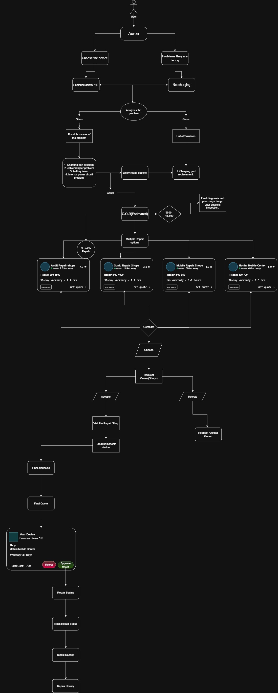

# Auren v1

## Goal

Build a working hackathon prototype that helps people understand a device problem, compare local repair options, and manage a repair from the first estimate through completion.

## User flow

The user selects a device and describes the problem. Auren presents possible causes, likely repair options, and an estimated cost range. The user can compare repair shops by price, rating, distance, and warranty, then request a queue with a chosen shop. If the shop rejects the request, the user can try another queue. If it accepts, the user visits the shop, gets a physical inspection and final quote, and approves or rejects the repair. Approved repairs can be tracked, with a digital receipt and repair history available afterward.

## V1 prototype scope

- **Problem intake:** choose a device and report the issue.
- **Guidance:** show possible causes, suggested repair options, and an estimated cost range. Make clear that the estimate may change after an in-person inspection.
- **Shop discovery:** show repair shops with comparison details such as estimated price, rating, distance, and warranty.
- **Queue request:** let the user request a shop queue and respond to acceptance or rejection, with an option to request another queue.
- **Quote and approval:** present the shop's final diagnosis and quote so the user can approve or reject the repair.
- **Repair follow-through:** show repair status and provide a digital receipt and repair history.

## Prototype boundary

The flow treats diagnosis and cost before inspection as estimates. A repair shop confirms the issue and final price after inspecting the device; the user decides whether to proceed.

----

## v1 Requirements

**What should be in the v1 to call the Auren a completed v1.**

1. 
